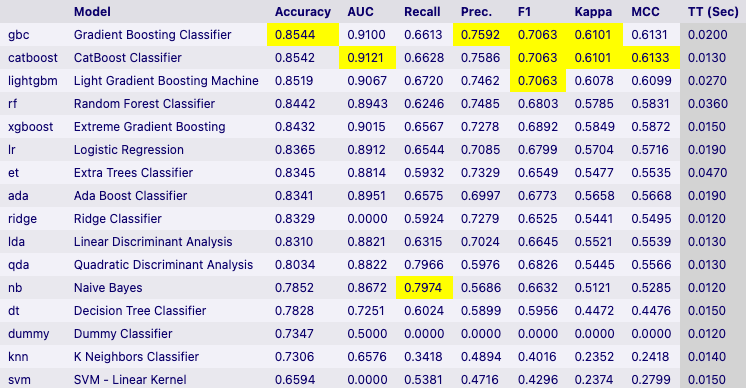
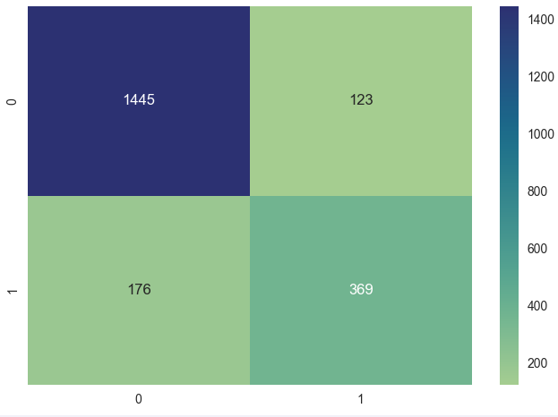

# AI300: Capstone Project - Telco Customer Churn Prediction (May23-Team05)

## Table of Contents
- [AI300: Capstone Project - Telco Customer Churn Prediction (May23-Team05)](#ai300-capstone-project---telco-customer-churn-prediction-may23-team05)
  - [Table of Contents](#table-of-contents)
  - [Team Members](#team-members)
  - [Website of Deployed Web Application](#website-of-deployed-web-application)
  - [Chosen Model and Features](#chosen-model-and-features)
  - [Offline AUC metrics of above model](#offline-auc-metrics-of-above-model)

## Team Members
- 👩🏻‍💼 Shan Xuan
- 👩🏻‍💼 Pei Quin

## Website of Deployed Web Application 
- [Deployed Capstone Website @ http://13.213.40.73/](http://13.213.40.73/)
- API address resource: `http://13.213.40.73/api/predict` 
  - Parameters documentation can be found [here](http://13.213.40.73/doc#apicall)

## Chosen Model and Features
- A list of features can be found [here](http://13.213.40.73/doc#inputfeatures)
- After using `pycaret` for model comparison and shortlisting both gradient boosting classifier and catboost classifier for model training and evaluation. The final chosen model is the following `catboost classifier`. 
- Hyperparameters of `catboost classifier`: `{'learning_rate': 0.025, 'depth': 4}`

## Offline AUC metrics of above model
- Both `gradient boosting classifier` and `catboost classifier` achieved an offline AUC of 0.90 for the test data. However, based on the confusion matrix below, `catboost classifier` performs slightly better. 

- **Gradient Boosting Classifier Confusion Matrix Plot**

- **CatBoost Classifier Confusion Matrix Plot**

